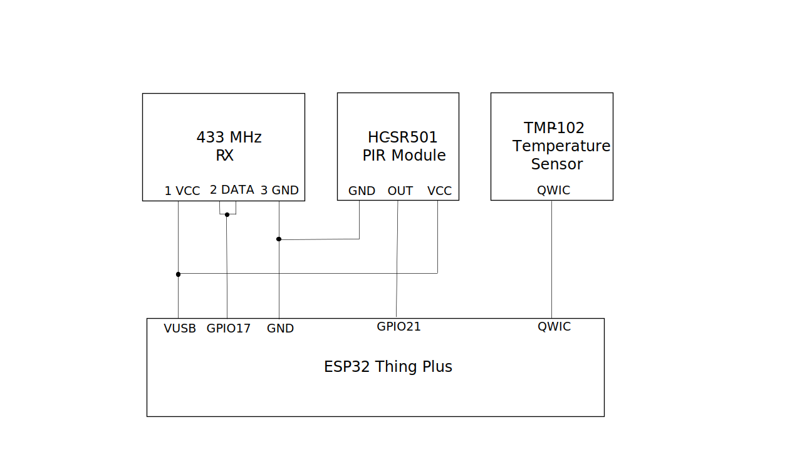
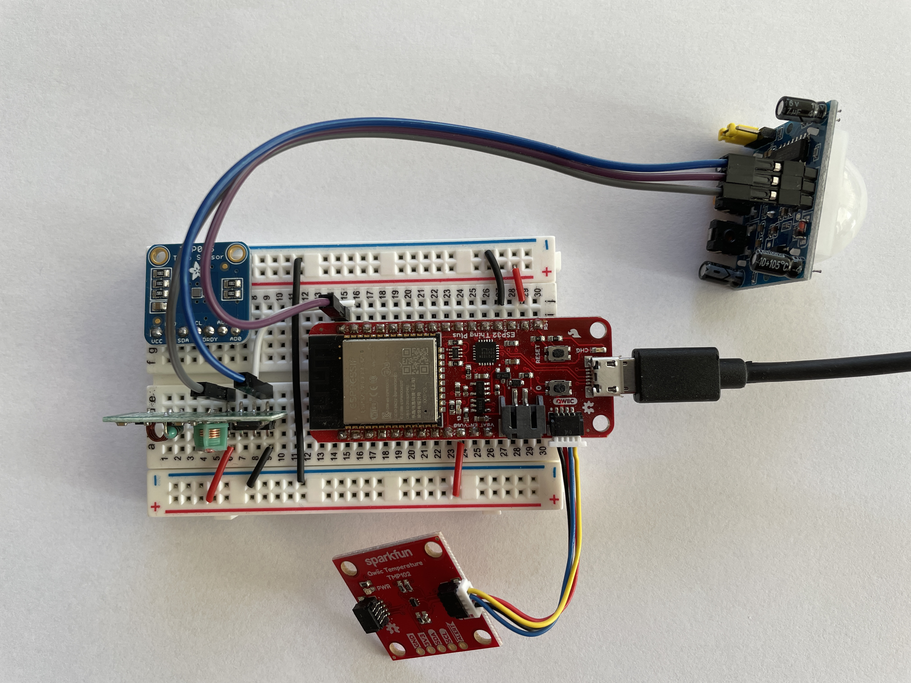
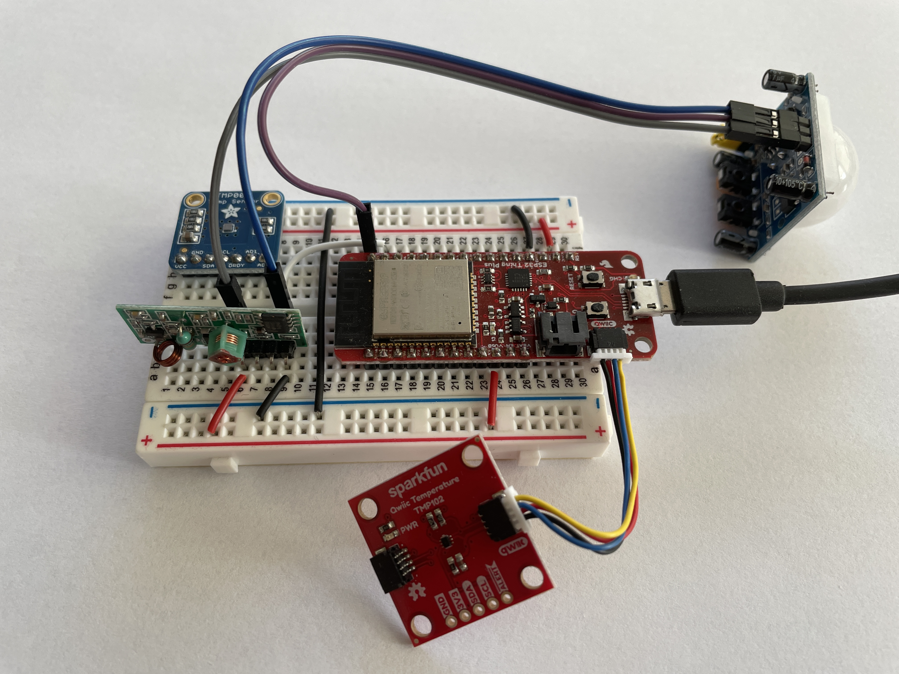

# RedSprite Energy Project - Investigating Cheap Temperature Sensing - Receiver

This repository forms one of a series related to the RedSprite Energy Project. In particular this repository
provides an Arduino project for a Sparkfun ESP32 Thing Plus (WRL-15663) which acts as a test for various sensors
and a 433MHz receiver. This repo should be used in conjunction with
[mdrftx](https://bitbucket.org/terzodigital/mdrftx/src/master/) which acts as a transmitter and tests another sensor.

## Overview

This repository provides a simple Arduino project which can read a temperature value from a temperature sensor,
read the state of a PIR module and receives values over a 433MHz RF receiver from a temperature sensor on that
remote transmitting board.

The figure above is the circuit diagram for this project.

The photos above show different views of the same built versions of the previous circuit diagram.

## Parts

This section lists the parts and then provides more detailed information for each of the parts in further subsections
where appropriate.

| Description | Part | Part Number | Quantity |
| ------------|------|-------------|----------|
| Processor | Sparkfun ESP32 Thing Plus | WRL-15663 | 1 |
| Temperature Sensor | - | - | 1 |
| PIR Sensor | - | - | 1 |
| RF Receiver | 433 MHz Receiver | - | 1 |
| Prototyping Breadboard | Breadboard | - | 1 |
| Wiring | Wires | - | As required |

### Sparkfun ESP32 Thing Plus

* [Hookup Guide](https://learn.sparkfun.com/tutorials/esp32-thing-plus-hookup-guide/all) - Use this to get going with the ESP32 Thing Plus

### 433 MHz RF Receiver

* [433 MHz RF TX and RX Modules Arduino Tutorial using Radiohead](https://lastminuteengineers.com/433mhz-rf-wireless-arduino-tutorial/)
* [RadioHead library](http://airspayce.com/mikem/arduino/RadioHead/)
* [A scond tutorial on using 433 MHz modules with Arduino and Radiohead](https://randomnerdtutorials.com/rf-433mhz-transmitter-receiver-module-with-arduino/)

### Temperature Sensor

* 
* 

## Building and Testing

You can follow the steps below to get the Arduino set up and working for this project:

1. Install Arduino
1. Add ESP32 board information source to the preferences. Go to File | Preferences and in Additional Board Manager URLsadd the following: https://raw.githubusercontent.com/espressif/arduino-esp32/gh-pages/package_esp32_index.json
1. May need to add the AVR Arduino Boards to Arduino
1. If necessary add the CP102 serial drivers to support the board on Windows
1. Install the DS18B20 library and its requirement (OneWire)
1. Install the RadioHead library from [Airspayce](https://airspayce.com) as a ZIP library using Sketch | Include Library | Add ZIP Library.

**Edit a file, create a new file, and clone from Bitbucket in under 2 minutes**

*We recommend that you open this README in another tab as you perform the tasks below. You can [watch our video](https://youtu.be/0ocf7u76WSo) for a full demo of all the steps in this tutorial. Open the video in a new tab to avoid leaving Bitbucket.*

---

